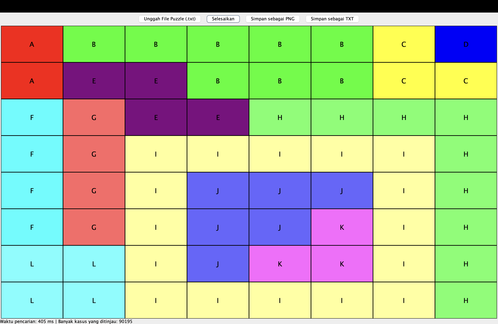
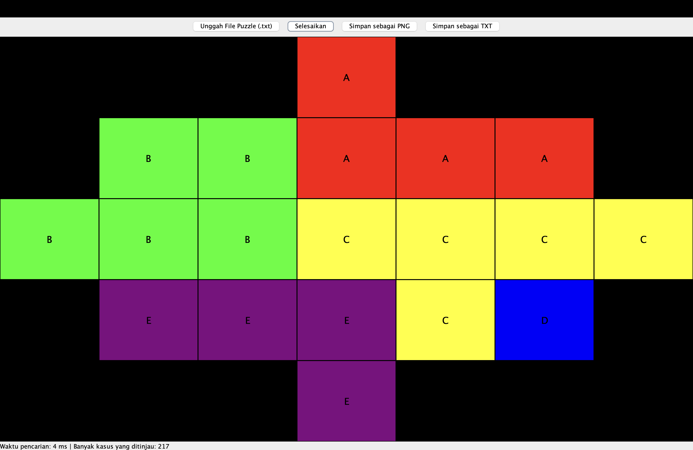

<h1 align="center">Tugas Kecil 1 IF2211 Strategi Algoritma</h1>
<h2 align="center">Semester II tahun 2024/2025</h2>
<h3 align="center">Penyelesaian IQ Puzzler Pro dengan Algoritma Brute Force</h3>




## Table of Contents
- [Description](#description)
- [Requirements & Installation](#requirements--installation)
- [Compilation](#compilation)
- [How to Use](#how-to-use)
- [Author](#author)


## Description
This program is an IQ Puzzler Pro Solver that utilizes a brute-force algorithm with backtracking to find solutions efficiently.

It offers two board configurations:
1. **DEFAULT** – A predefined board setup.
2. **CUSTOM** – Allows users to define their own board layout.

The program supports both CLI and GUI modes, providing flexibility for different user preferences. Users can input their puzzle configurations and choose to save the solution as a TXT file or PNG image.

## Requirements & Installation
1. Install Java Development Kit (JDK) 17 or later
2. Clone the repository
    ```bash
    git clone https://github.com/carllix/Tucil1_13523091.git
    ```
3. Navigate to the project directory
    ```bash
    cd Tucil1_13523091
    ```

## Compilation

```bash
javac -d bin src/*.java
```

## How to Use
**Using GUI**
1. Run the following command:
    ```bash
    java -cp bin src.GUI
    ```
2. Upload your input file.
3. Click the "Selesaikan" button to solve the puzzle.
4. If you want to save the output, you can choose to save it as a TXT or PNG file.

**Using CLI**
1. Run the following command:
    ```bash
    java -cp bin src.CLI
    ```
2. Enter the input filename.
3. If you want to save the output, you can choose to save it as a TXT file, a PNG file, or both.

## Author
Name : Carlo Angkisan <br>  
NIM : 13523091 <br>  
Email : carloangkisan21@gmail.com
